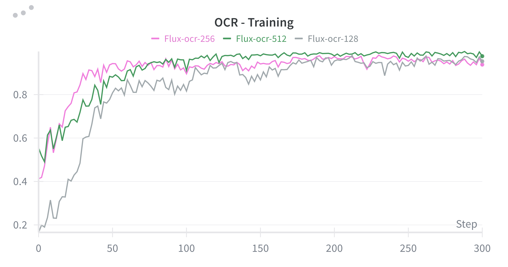
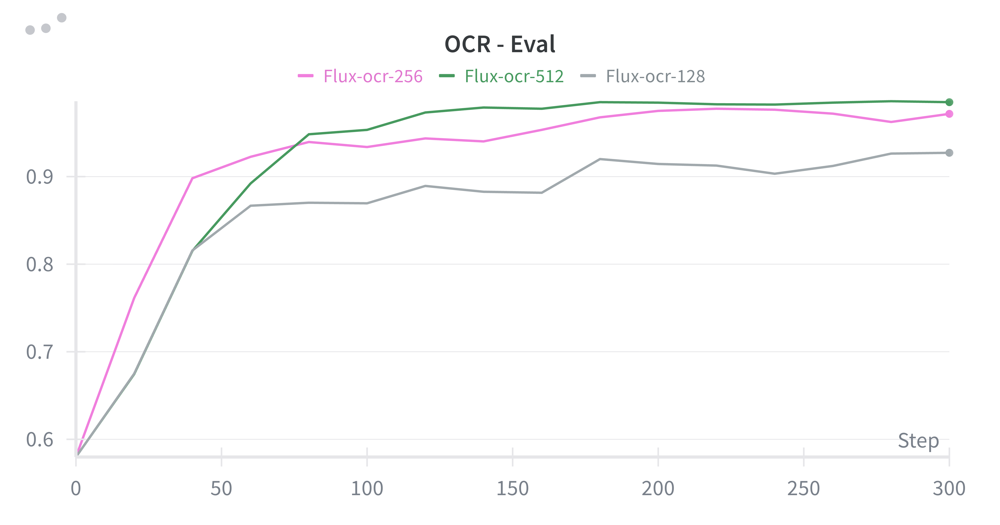

<h1 align="center"> PaCo-GRPO Training Guide </h1>

<div align="center">
  <a href='https://arxiv.org/abs/2512.04784'></a>  &nbsp;
  <a href='https://x-gengroup.github.io/HomePage_PaCo-RL/'></a> &nbsp;
  <a href="https://github.com/X-GenGroup/PaCo-RL"></a> &nbsp; 
  <a href='https://huggingface.co/collections/X-GenGroup/paco-rl'></a> &nbsp;
</div>

## 📋 Table of Contents

- [Get Started](#-get-started)
  - [Environment Setup](#1-environment-setup)
  - [Model Download](#2-model-download)
  - [Reward Server](#3-reward-server)
  - [Start Training](#4-start-training)
- [Decoupled Training](#-decoupled-training)
  - [Resolution-decoupled Training](#resolution-decoupled-training)
  - [Decouple Training and Testing Reward Functions](#decouple-training-and-testing-reward-functions)
- [Multi-reward Configuration](#-multi-reward-configuration)
  - [Weighted Multi-Reward](#weighted-multi-reward)
  - [Custom Aggregation Functions](#custom-aggregation-functions)
  - [Cross-Model Evaluation](#cross-model-evaluation)
- [Acknowledgement](#-acknowledgement)
- [Citation](#-citation)

## 🚀 Get Started

### 1. Environment Setup

Clone this repository and install packages:
```bash
cd PaCo-GRPO
conda create -n paco-grpo python=3.12 -y
conda activate paco-grpo
pip install -e .
```

### 2. Model Download

#### Policy Models

Pre-download the corresponding models:

| Model | HuggingFace Path |
|- | - |
| **Flux** | `black-forest-labs/FLUX.1-dev` |
| **Flux-Kontext** | `black-forest-labs/FLUX.1-Kontext-dev` |
| **Qwen-Image-Edit** | `Qwen/Qwen-Image-Edit` |

> **Note**: Model paths can be configured in `config/grpo.py`.

#### Reward Models

**For Text-to-ImageSet task** (using three rewards), run the following commands to download models in the cache:
```bash
# PickScore
python paco_grpo/rewards/pickscore_scores.py

# CLIP-T
python paco_grpo/rewards/subfig_clipT.py

# Consistency Score
hf download X-GenGroup/PaCo-Reward-7B
```

**For Image Editing task** (using single reward):
```bash
# Consistency Score for Editing
hf download X-GenGroup/Paco-Reward-7B
```

### 3. Reward Server

During training, each process maintains a scorer of `CLIP-T` and `PickScore` for itself respectively. We use [vLLM](https://github.com/vllm-project/vllm) to deploy Paco-Reward-7B for reward computation.

**Create vLLM environment:**
```bash
conda create -n vllm python=3.12 -y
conda activate vllm
pip install vllm
```

> **Troubleshooting**: See [vLLM Docs](https://docs.vllm.ai/en/stable/) if you encounter installation issues.

**Launch reward server:**

On the single node with 8*80GB gpus, launch the vLLM server on the first GPU:
```bash
export CUDA_VISIBLE_DEVICES=0
export GPU_MEMORY_UTILIZATION=0.85
export VLLM_MODEL_PATHS='X-GenGroup/PaCo-Reward-7B'
export VLLM_MODEL_NAMES='Paco-Reward-7B'
conda activate vllm
bash vllm_server/launch.sh
```

### 4. Start Training
Launch training on the rest gpus:
```bash
export CUDA_VISIBLE_DEVICES=1,2,3,4,5,6,7
# Activate training environment
conda activate paco-grpo

# Text-to-ImageSet with FLUX
bash scripts/single_node/train_flux.sh t2is

# Image Editing with Flux-Kontext
bash scripts/single_node/train_flux_kontext.sh kontext_editing

# Image Editing with Qwen-Image-Edit
bash scripts/single_node/train_qwenimage_edit.sh qwen_editing
```

## 🔄 Decoupled Training

### Resolution-decoupled Training

The training cost for DiT models increases **quadratically** with respect to the image resolution. We discovered that sampling and training on lower-resolution images can still provide **effective reward signals** and successfully guide the model toward better performance.

To validate this insight, we trained `FLUX.1-dev` on the `OCR` task using image resolutions of `128`, `256`, and `512`, respectively. Critically, the evaluation curves for all experiments are based on a consistent `512` resolution. *Note that only the sampling and training phases use the lower resolutions.*

> Inspired by FlowGRPO-Fast, SDE sampling is specifically applied only at timestep index 1 with a noise level of $a=0.8$.

<div align="center">
  
  <p><em>Training curves with different resolutions (128, 256, 512)</em></p>
  
  
  <p><em>Evaluation curves at 512 resolution</em></p>
</div>


To implement this, set the following arguments in `config/grpo.py`:
```python
# For simple tasks like GenEval, OCR, or PickScore:
config.train.resolution = 256
config.test.resolution = 512

# For the Text-to-ImageSet task,
# e.g., where the output image is a 2x2 grid layout of 4 512x512 sub-images:
config.train.resolution = 512
config.test.resolution = 1024
```

If `config.prompt_fn` is set to `geneval`, where the dataset utilizes the jsonl format, you may also set specific `height` and `width` keys for each individual item within the dataset.

### Decouple Training and Testing Reward Functions

Use different reward configurations for training and testing:
```python
config.train.reward_fn = {
    "consistency_score": 0.2,
    "subfig_clipT": 1,
    "pickscore": 1,
}

config.test.reward_fn = {
    "consistency_score": 0.1,
    "subfig_clipT": 1.5,
    "pickscore": 1,
}
```

## 🎯 Multi-reward Configuration

### Weighted Multi-Reward

Configure reward weights in `config/grpo.py`:
```python
config.train.reward_fn = {
    "consistency_score": 0.2,
    "subfig_clipT": 1,
    "pickscore": 1,
}

config.test.reward_fn = {
    "consistency_score": 0.2,
    "subfig_clipT": 1,
    "pickscore": 1,
}
```

### Custom Aggregation Functions

The code supports customized functions for multi-reward aggregation:
```python
# Default: weighted sum
config.train.aggregate_fn = None

# Use geometric mean
config.train.aggregate_fn = geometric_mean_aggregate_fn  # See config/grpo.py

# Use weighted advantage sum (normalize each reward separately before aggregation)
config.train.aggregate_fn = weighted_advantage_sum_aggregate_fn(
    reward_weights=config.train.reward_fn,
    global_std=True
)

# Define custom aggregation
def summation_agg_fn(**grouped_rewards):
    """
    Args:
        **grouped_rewards: Each kwarg is dict[str, np.ndarray]
        
    Example:
        grouped_rewards = {
            'consistency_score': {'p1': [0.1, 0.2], 'p2': [0.3, 0.4]},
            'subfig_clipT': {'p1': [0.3, 0.4], 'p2': [0.5, 0.6]}
        }
    
    Returns:
        dict[str, np.ndarray]: Aggregated advantages for each prompt
    """
    prompts = next(iter(grouped_rewards.values())).keys()
    advantages = {}
    for prompt in prompts:
        reward_stack = np.stack([
            grouped_rewards[reward_name][prompt] 
            for reward_name in grouped_rewards
        ], axis=0)
        advantages[prompt] = np.sum(reward_stack, axis=0)
    
    return advantages
    # Note: Weights (if needed) should be applied inside the aggregation function
```

### Cross-Model Evaluation

Use different MLLMs for training vs. testing:
```python
config.train.reward_fn_kwargs = {
    'consistency_score': {
        'model': 'Paco-Reward-7B',
        'port': 8000
    },
}

config.test.reward_fn_kwargs = {
    'consistency_score': {
        'model': 'Gemma-3-4B-IT',
        'port': 8000
    },
}
```

#### Option 1: Unified Port with Multiple Models

Launch multiple MLLM servers on the same port:
```bash
export VLLM_MODEL_PATHS="X-GenGroup/PaCo-Reward-7B,google/gemma-3-4b-it"
export VLLM_MODEL_NAMES="Paco-Reward-7B,Gemma-3-4B-IT"
export VLLM_PORT=8000
export VLLM_LABEL='multi_server'
bash vllm_server/launch.sh
```

> **Note**: `launch.sh` handles multi-model serving via FastAPI, allowing access to different MLLMs through port `8000` with specific `VLLM_MODEL_NAME`.

#### Option 2: Separate Ports (Recommended for Performance)

For better performance, launch servers on different ports:
```bash
# Terminal 1: Launch Paco-Reward server
export VLLM_MODEL_PATHS="X-GenGroup/PaCo-Reward-7B"
export VLLM_MODEL_NAMES="Paco-Reward-7B"
export VLLM_PORT=8000
export VLLM_LABEL='paco-reward'
bash vllm_server/launch.sh

# Terminal 2: Launch Gemma server
export VLLM_MODEL_PATHS="google/gemma-3-4b-it"
export VLLM_MODEL_NAMES="Gemma-3-4B-IT"
export VLLM_PORT=8001
export VLLM_LABEL='gemma'
bash vllm_server/launch.sh
```

Update configuration accordingly:
```python
config.train.reward_fn_kwargs = {
    'consistency_score': {
        'model': 'Paco-Reward-7B',
        'port': 8000
    },
}

config.test.reward_fn_kwargs = {
    'consistency_score': {
        'model': 'Gemma-3-4B-IT',
        'port': 8001
    },
}
```

## 🤗 Acknowledgement

This repository is based on [Flow-GRPO](https://github.com/yifan123/flow_grpo) and [vLLM](https://github.com/vllm-project/vllm). We thank the authors for their valuable contributions to the community.

## ⭐ Citation

If you find this work helpful, please cite:
```bibtex
@misc{ping2025pacorladvancingreinforcementlearning,
    title={PaCo-RL: Advancing Reinforcement Learning for Consistent Image Generation with Pairwise Reward Modeling}, 
    author={Bowen Ping and Chengyou Jia and Minnan Luo and Changliang Xia and Xin Shen and Zhuohang Dang and Hangwei Qian},
    year={2025},
    eprint={2512.04784},
    archivePrefix={arXiv},
    primaryClass={cs.CV},
    url={https://arxiv.org/abs/2512.04784},
}
```

<div align="center">
  <sub>⭐ Star us on GitHub if you find PaCo-RL helpful!</sub>
</div>